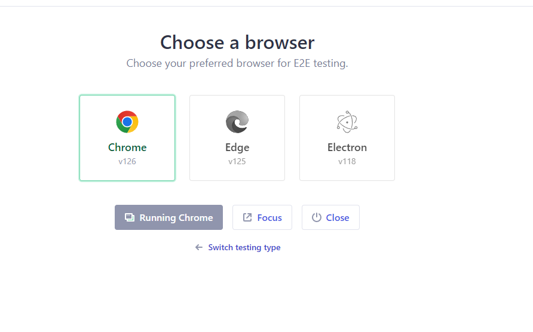
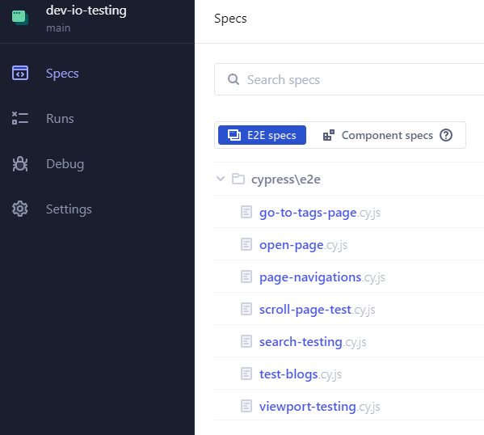

# Cypress E2E Testing

### SEEU - Software Testing and Analysis Project


## Target Site: `dev.io` 

### Setup

- Clone this repository 

```bash
git clone {repo_url}
```

- Install `npm` packages:

```bash
npm install
```

- Start project

```bash
npx cypress open
```

- Choose browser from th `cypress` application



- Navigate to specifications and choose which testing you want to start

